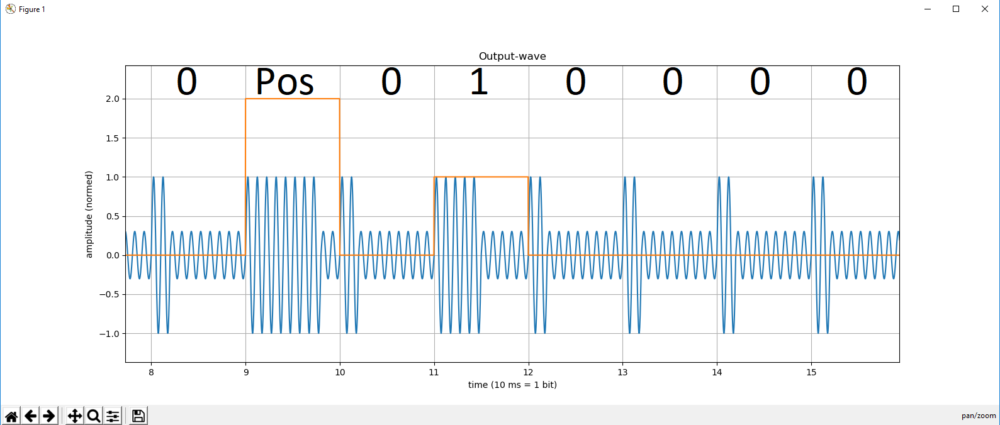

This is a simple Phyton3 script wich generates a customable IRIG-B wav-file (format "A", left and right channel identic). After Generating the file it opens a plot, wich displays the waveform, bits and position markers. I proggramed it to test Hardware but you can also just listen to the wunderful sound of IRIG :-)

This is the output plot:

*output-plot with matplotlib after generating the wav-file*

The blue line showes the normed voltage characteristics of the outputsignal and the orange line shows the interpetation of the irig-code. 2 means Position Identifier, 1 and 0 means digital 1 and 0.

inspirations:

wave-code example http://blog.acipo.com/wave-generation-in-python/

irig-code: http://manuals.spectracom.com/NC/Content/NC_and_SS/Com/Topics/APPENDIX/IRIGb.htm
